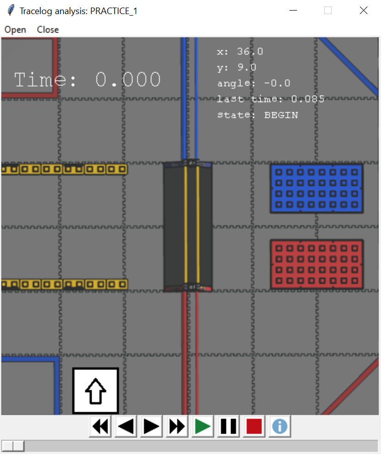

# FTC Log Analyzer

## A timeline-based analysis tool for FTC autonomous logs generated by the TRC library

---

---

## Installation:
This script depends on `numpy` and `pygame` to run correctly. You can install both by running `python3 -m pip install -r requirements.txt` (`py -m pip install -r requirements.txt` if using Windows) in this directory.

## Versions:
It is recommended to use the latest version of Python to run this tool, although it will likely work with versions not far behind. It will not work with Python 2.

As far as I'm aware, this should work fine on macOS and Linux as well as Windows, although I only really tested it on Windows.

## Running:
To open a log file you can open `log_analyzer.pyw` by double clicking it or running `python3 log_analyzer.pyw` (`py` instead of `python3` if using Windows). Then, click the `Open` button on the top menu bar of the window and select the .log file you want to open.

You can also run the file with the log file path supplied as an argument (e.g. `python3 log_analyzer.pyw ~/tracelogs/something.log`) or by dragging the file directly onto the script in the file explorer. Both of these methods will directly open up to the specified file.

## Controls:
The button controls (left to right) are as follows:

* Jump back - Jumps to the beginning of the log
* Step back - Moves one position entry back in the log
* Step forward - Moves one position entry forward in the log
* Jump forward - Jumps to the end of the log
* Play - What you would expect
* Pause - Also what you would expect
* Stop - Pauses and jumps to the beginning of the log
* Info - Opens (or focuses if already open) a window containing extra PID information and displays PID errors relative to the robot

The `Open` button at the top of the window can be used to open a new log file, and the `Close` button closes the window.

The timeline at the bottom can be scrolled left and right and moves with the stopwatch timer.